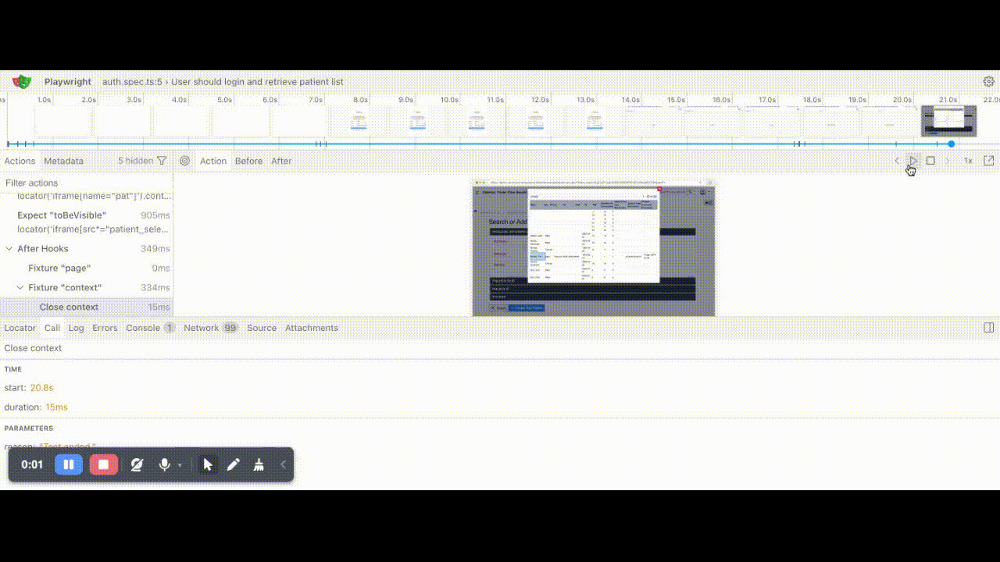

# ## OpenEMR Healthcare - Automation Suite

## 📑 Executive Summary
This project focuses on automating core workflows within OpenEMR, a legacy electronic medical record system. The primary goal was to solve the technical hurdles posed by the application’s extensive use of iframes, ensuring that automated tests remain stable and maintainable.

## 🛠 Technical Stack
* Language: **TypeScript**
* Framework: **Playwright**
* Architecture: **Page Object Model (POM)**
* Locators: **frameLocator, getByText, Regex**

## 📊 Test Coverage
* **Functional**: Core success paths for login and navigation.
* **Security**: Validation of unauthorized login attempts (auth.negative.spec.ts).
* **Stability**: Handling of empty credential states to verify application error messaging.

## 🔎 Project Highlights & Solutions
* **Piercing Iframes**: Successfully navigated OpenEMR’s legacy architecture using frameLocator to interact with hidden clinical modules.
* **Scalable Architecture**: Utilized POM to separate selectors from test logic, ensuring high maintainability.
* **Security Validation**: Built dedicated suites for Negative Testing to ensure robust handling of unauthorized access.

## ▶ How to Run
- Install Dependencies:
**npm install**
- Execute All Tests:
**npx playwright test**
- View HTML Report:
**npx playwright show-report**

## 📁 Project Artifacts

| Test Suite |       Status |         Artifacts |
| :--- | :--- | :--- |

| **Functional Success** | Passed | [Screenshot](./evidence/auth.spec.png) • [Video](./evidence/auth.spec.mp4) |

| **Security/Negative**	| Passed | [Screenshot](./evidence/auth.negative.spec.png) • [Video](./evidence/auth.negative.spec.mp4) |

| **Empty State** | Passed	| [Screenshot](./evidence/empty.spec.png) • [Video](./evidence/empty.spec.mp4) |

**Execution Report**
Proof of a stable, 100% pass rate across the specialized test suite.
**Trace Viewer Debugging**
I utilize the Playwright Trace Viewer as my primary diagnostic tool. This allows for a frame-by-frame post-mortem analysis of the automation lifecycle, which is essential for debugging complex iframe interactions in healthcare environments.

## Technical Performance Notes

**Optimization:** Configured specifically for Chromium to maximize execution speed and resource efficiency on mobile workstations.
**CI/CD:** Includes GitHub Actions workflows for automated pipeline readiness.