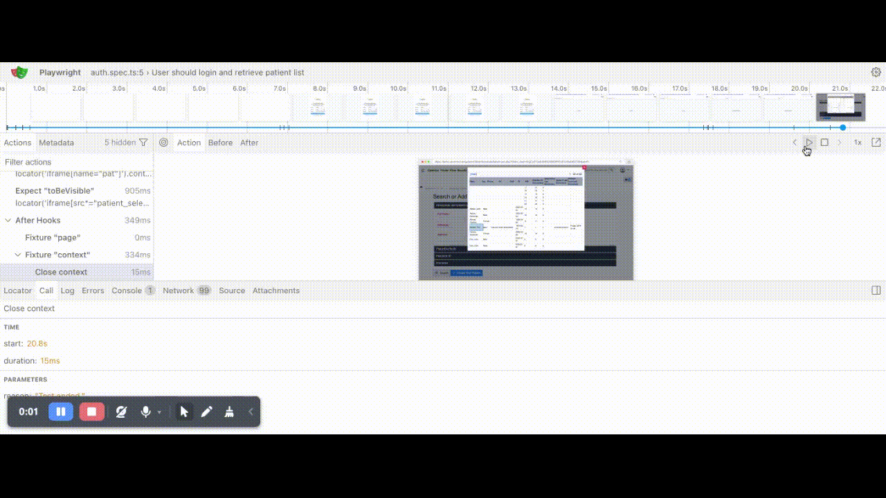

# 🏥 OpenEMR Playwright Automation Framework

An enterprise-grade End-to-End (E2E) and API test automation framework built for **OpenEMR** using **Playwright**, **TypeScript**, and the **Page Object Model (POM)** architecture.

This project demonstrates how to automate complex legacy EHR web applications featuring nested iFrames, dynamic UI overlays, native JavaScript dialogs, containerized infrastructure, and hybrid API/UI data validation.

---

## 📸 Framework in Action



---

## 🌟 Key Highlights

- **Scalable Page Object Model (POM):** Clean separation of page locators, workflows, and test assertions (`BasePage`, `LoginPage`, `PatientPage`).
- **Hybrid E2E + API Testing:** Uses Playwright `APIRequestContext` (`PatientClient.ts`) to execute direct API health checks and fast backend data seeding.
- **Complex iFrame Synchronization:** Solves multi-frame synchronization issues in OpenEMR using `frameLocator` chains and explicit state assertions.
- **Dynamic Data Builders:** Utilizes `@faker-js/faker` (`patient-builder.ts`) to generate unique, isolated test data for every execution.
- **Custom Test Fixtures:** Extends Playwright's `test` runner with pre-instantiated page objects and API clients (`page-fixtures.ts`).
- **Dual CI/CD Pipeline:** Fully configured with **GitHub Actions** for automated reporting/artifact retention on push, alongside a declarative **`Jenkinsfile`** for enterprise build nodes.
- **Containerized Environment:** Ships with a complete `docker-compose.yml` stack (OpenEMR + MariaDB) for isolated, reproducible local execution.

---

## 🛠️ Tech Stack

- **Language:** TypeScript
- **Test Runner:** Playwright Test
- **Design Pattern:** Page Object Model (POM) & Custom Fixtures
- **API Client:** Playwright `APIRequestContext`
- **Data Generation:** Faker.js
- **Infrastructure:** Docker Compose (OpenEMR + MariaDB)
- **CI/CD:** GitHub Actions & Jenkins

---

## 🧪 Test Coverage & Architecture

| Test Suite                  | File                       | Scope / Type  | Description                                                                |
| :-------------------------- | :------------------------- | :-----------: | :------------------------------------------------------------------------- |
| **Authentication Negative** | `auth.negative.spec.ts`    | Security / UI | Verifies login refusal and error messages for invalid credentials.         |
| **Empty Validation**        | `empty.spec.ts`            | UI Validation | Checks client-side validation when submitting empty form fields.           |
| **API Health & Hybrid**     | `patient-api.spec.ts`      | API / Session | Validates backend API endpoints and session consistency.                   |
| **Patient Creation**        | `patient-creation.spec.ts` | E2E Workflow  | Handles iFrames, native popups, and completes full patient registration.   |
| **Patient Search**          | `patient-search.spec.ts`   | E2E Workflow  | Retrieves patient records inside frame-based tables and validates headers. |

---

## 📁 Repository Structure

```text
├── .github/workflows/   # CI/CD pipeline definitions (playwright.yml)
├── api/                 # API clients for backend interaction (PatientClient.ts)
├── data/                # Data builders and Faker generation logic (patient-builder.ts)
├── evidence/            # Portfolio media, execution recordings, and traces
├── fixtures/            # Custom Playwright test fixtures (page-fixtures.ts)
├── page-objects/        # Page Object Model classes (BasePage, LoginPage, PatientPage)
├── tests/               # E2E and API spec test files
├── docker-compose.yml   # Local environment orchestration
├── Jenkinsfile          # Jenkins declarative CI pipeline
├── playwright.config.ts # Global Playwright configuration
└── package.json         # Project dependencies and scripts
```

## 🚀 How to Run Locally

### 1. Prerequisites

- **Node.js:** v18 or higher
- **npm:** v9 or higher

### 2. Installation

```bash
git clone [https://github.com/santiagodiazola/openemr-playwright-automation.git](https://github.com/santiagodiazola/openemr-playwright-automation.git)
cd openemr-playwright-automation
npm install
npx playwright install --with-deps chromium
```

---
